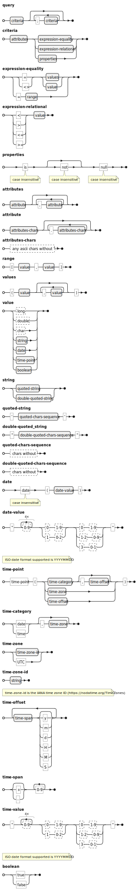

# qsl
Illustrates JavaCC usage with a simple Query Specific Language.

```java
@Test
public void parseQuery() throws ParseException {
    String search = """
            strawberry.family  =  'Rosaceae';
            strawberry.genius  =  'Fragaria';
            strawberry.species <> "F. virginiana";
            strawberry.energy  >  136;
            strawberry.sugars  =  [4,5];
            strawberry.sale    >= time-point(date, 'Europe/Paris', 25d 2m 2025y)
            """;
    Query ltm = makeQueryParser(search);
    var query = parse(ltm.criterias());
    assertEquals("strawberry.family='Rosaceae';strawberry.genius='Fragaria';strawberry.species<>\"F. virginiana\";strawberry.energy>136;strawberry.sugars=[4,5];strawberry.sale>=time-point(date,'Europe/Paris',25d2m2025y)", query);
}
```
The query grammar is defined as follows:

